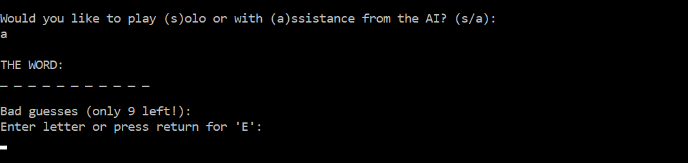

# Hangman Plus AI

**A console version of the classic word-guessing game, featuring a nearly unbeatable AI.**

[Play it here!](https://repl.it/@karafto/hang-ai) (press 'run')

## Features

* The AI makes moves based on conditional probability and knowledge of the dictionary. Using feedback from prior moves, it recursively eliminates entries and recalculates letter frequency. Here it is in action:

* Users can override the AI and manually input a guess. Correct or not, the AI will continue to eliminate words accordingly.
* Users have the option to play solo or with support from the AI.
* Users can save games upon exiting and then resume them later.

## Installation

1. Clone the repo: `$ git clone https://github.com/karafto/hang-ai.git`
2. Move into the new directory: `$ cd hang-ai`
3. To play: `$ ruby hangman.rb`

## Future Directions

* Two-player mode with scorekeeping
* More advanced options for saving/loading