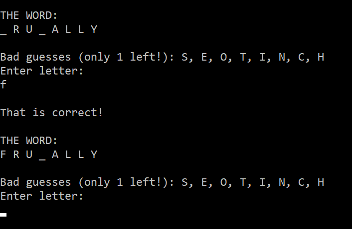

# Hangman

## Installation

Ensure that Ruby is installed on your machine

Clone the repo: `$ git clone https://github.com/karafto/Hangman.git`

Move into the new directory: `$ cd hangman`

To play: `$ ruby game.rb`